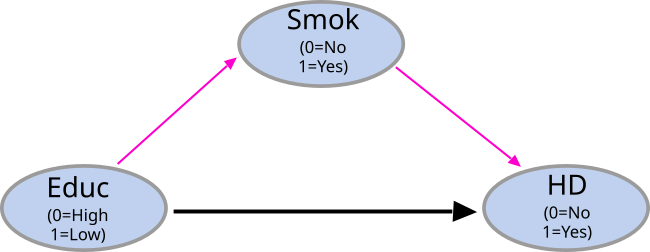
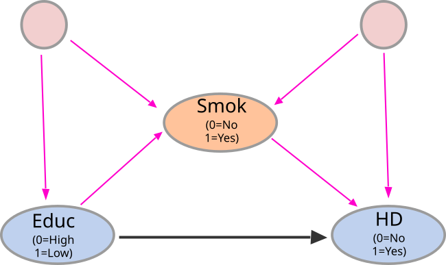
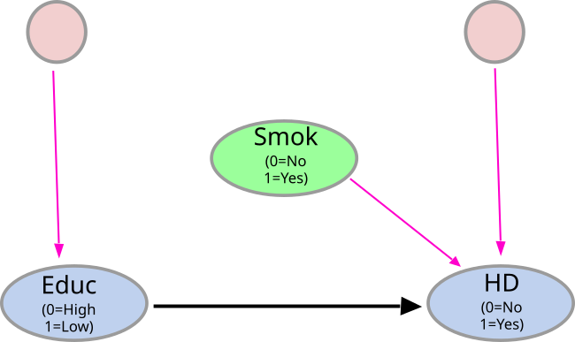
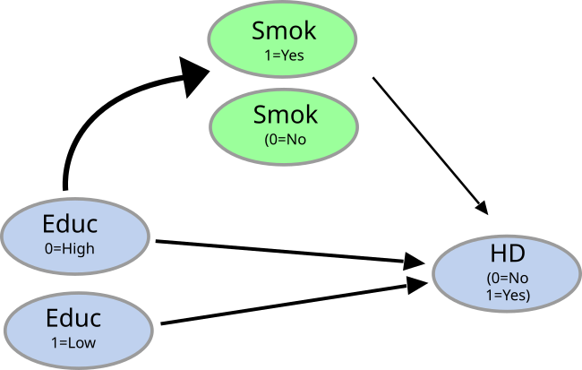
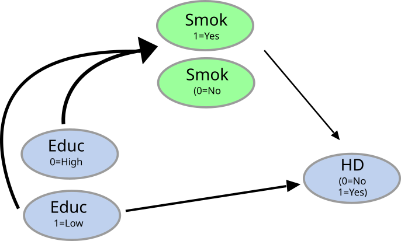

```{r setup, include = FALSE}
library(knitr)
library(tidyverse)
library(xaringanExtra)
library(janitor)
library(kableExtra)
library(medflex)
library(fontawesome)

source("helper_functions.R")

# set default options
opts_chunk$set(echo = FALSE,message = FALSE,warning = FALSE)

xaringanExtra::use_xaringan_extra(c("tile_view", "animate_all", "tachyons", 
                                    "panelset","scribble","fit_screen"))

xaringanExtra::style_panelset_tabs(
  active_foreground = "#0051BA",
  hover_foreground = "#d22",
  font_family = "Roboto"
  )

xaringan::summon_remark(to = "libs")

```
```{r include=FALSE}

# df <- readRDS("r_data.rds")
# set.seed(198511)
# data <- df %>% dplyr::select(id=samplenumber19, 
#                       bmi=bmi, educ=educ5_19, age=age_meibo19, 
#                       sex= sex_meibo19, smok= smok5_19, 
#                       hd=dgns2hd19, dm= dgns2dm19) %>%
#   mutate_all(as.numeric) %>%
#   filter(bmi>16 & bmi<40) %>% 
#   na.omit() %>%
#   filter(educ!=5) %>%
#   sample_n(5000) %>%
#   mutate(id= 1:length(id),
#          sex= factor(sex,
#                      levels = c("1","2"),
#                      labels = c("M","F")),
#          smok= factor(smok,
#                       levels=  paste0(1:5),
#                       labels = c("S","S","S","S","NS")),
#          educ= factor(educ,
#                       levels = paste0(1:4),
#                       labels = c("L","L","M","H"))
#          )
# 
# saveRDS(data,file="demo.rds")

data <- readRDS("demo.rds")

data <- data %>% dplyr::select(id,educ,smok,hd, age,sex)

```

class: title-slide, left, bottom
background-image: url("title.jpg")
background-position: 80% 0%
background-size: auto 


# `r rmarkdown::metadata$title`
<hr>            <!-- horizontal line --> 


## .purple[_Causal mediation using __medflex__ `r fa("r-project", fill = "steelblue")` package_]
#### _`r rmarkdown::metadata$author`_
.date[.grey[ 2022/03/04 (updated: `r Sys.Date()`)]]

---
class: inverse
background-image: url("flare.png")
background-position:100% 0%
background-size: 35% auto 

# Objectives 

- To understand the intuition behind;

 1. Controlled Direct Effect (.red[CDE])
 
 2. Natural Direct Effect (.green[NDE])
 
 2. Natural Indirect Effect (.blue[NIE])
 
- Advantages of .red[_medflex_] package over .red[_paramed_] & .red[_med4way_].

- Understand the implementation of _medflex_ using an example.
 
---

```{r echo=FALSE}
xaringanExtra::style_panelset_tabs(
  active_foreground = "#0051BA",
  hover_foreground = "#fc03a5",
  hover_border_color = "#03fc98",
  tabs_border_bottom = "#f77c7c",
  active_border_color = "#e7fc03",
  font_family = "Roboto"
)


```

# CDE, NDE, & NIE
<hr>


.panelset[ 

.panel[.panel-name[Mediation]
  <br>
 .w-85.center[
 ]

]

.panel[.panel-name[Why not controlling]
  <br>
 .pull-left[
 <br>
 .w-80[
  ]]
 
 .pull-right[.w-85[
  ]]

]

.panel[.panel-name[Intervene on mediator]

 .pull-left[
  .w-60[
  ]
  ]
  
  .pull-right[
  .w-80[
  ]
  ]
  
`r fa("check", fill = "green")` If we .green[intervene] on mediator (setting it to a predetermined value [m]), all __incoming arrows__ to the mediator goes away.

]

.panel[.panel-name[CDE]

.w-40.absolute.left-4.center[
]


 .pull-right[

 
$$CDE= \mathbb{E}[Y_{(A=1,M=m)} - Y_{(A=0,M=m)}]$$


$$[Y_{(A=1,M=m)}]= [HD_{(Educ=1, Smok=1|0)}]$$ 


$$[Y_{(A=0,M=m)}]= [HD_{(Educ=0, Smok=1|0)}]$$ 
 
 ### .red[Two main limitations of CDE]
 
 1. We get multiple $CDEs$  based on the value we set on $m$ 
 2. Cannot decompose into .green[_direct effect_] and .yellow[_indirect effect_]
  
 ]
 
 
 ]


.panel[.panel-name[NDE]

.w-40.absolute.left-4.top-2[
]


 .pull-right[

 
$$NDE= \mathbb{E}[Y_{(A=1, M|A=0)} - Y_{(A=0, M|A=0)}]$$


$$[Y_{(A=1, M|A=0)}]= [HD_{(Educ=1, Smok|Educ=0)}]$$ 


$$[Y_{(A=0, M|A=0)}]= [HD_{(Educ=0, Smok|Educ=0)}]$$
 

  
 ]
 
 <br>
  ### .red[Why "Natural"]
 
Mediator is taking its natural values related to  absence of the exposure.
 
Eg: Individual 1;  Level of smoking if the individual is exposed to high level of education (A=0).
 

]

.panel[.panel-name[NIE]

.w-40.absolute.left-4.center[
]


 .pull-right[

 
$$NIE= \mathbb{E}[Y_{(A=1, M|A=1)} - Y_{(A=1, M|A=0)}]$$


$$[Y_{(A=1, M|A=1)}]= [HD_{(Educ=1, Smok|Educ=1)}]$$ 


$$[Y_{(A=1, M|A=0)}]= [HD_{(Educ=1, Smok|Educ=0)}]$$
.center[   
### .red[Total Effect (TE)]
   
   
$$TE= NDE+NIE$$
 ] 
  
 ]
 
]

] 

---
class: inverse
background-image: url(mod_types.png)
background-size: 50% auto
background-position: 100px 30%

## Advantages of using .red[_medflex_] to estimate natural effect models
<hr>

<br><br><br><br><br>
###  .yellow[Can estimate with any interaction/ effect modifications]
- $Exposure * Mediator$
- $Exposure * Covariate$
- $mediator * Covariate$
- $(Exposure * mediator) * covariate$


---
class: inverse
background-image: url(mod_types.png)
background-size: 50% auto
background-position: 100px 30%

## Advantages of using .red[_medflex_] to estimate natural effect models
<hr>

<br><br><br><br><br>
###  .yellow[Not restricted to parametric models]
### .yellow[Allows users to fit an imputation model using .red[_GAM_] or ensemble techniques implemented in the .red[SuperLearner].]
---
background-image: url(workflow.png)
background-position: center
background-size: auto 60% 

## Basic _medflex_ workflow 
<hr>

---
## Imputation based approach example using JAGES-2019
<hr>
`r fa("exclamation-triangle", fill = "yellow")`  Causal mediation cannot be done using cross-sectional data (using them just to demonstrate the method)


```
data %>% head(5)
```

```{r}
data %>% head(5) %>%  flextable::regulartable() %>% 
  flextable::colformat_double(digits = 2)
```

---

### Creating a extended dataset by imputing counterfactual outcomes
<hr>

``` 
impFit <- glm(hd ~ educ * smok + sex + age,
              family = binomial("logit"), data = data)
expanded_data <- neImpute(impFit)
```

.pull-left[

```{r}
impFit <- glm(hd ~ educ * smok + sex + age,
              family = binomial("logit"), data = data)

expanded_data <- neImpute(impFit)

head(expanded_data) %>% flextable::regulartable() %>% 
  flextable::colformat_double(digits = 2)

```

The outcomes are no longer binary, but are substituted by conditional mean imputations

]

.pull-right[

```{r}
data %>% head(5) %>%  flextable::regulartable() %>% 
  flextable::colformat_double(digits = 2)
```


]


---
## Fitting NE model using expanded dataset
<hr>

.panelset[ 

.panel[.panel-name[Code]

```
neMod1 <- neModel(hd ~ educ0 * educ1 + sex + age,
                  family = binomial("logit"), expData = expanded_data, se = "robust")

summary(neMod1)
```


]

.panel[.panel-name[Results]

```{r}
neMod1 <- neModel(hd ~ educ0 * educ1 + sex + age,
                  family = binomial("logit"), expData = expanded_data, se = "robust")

summ<- summary(neMod1)

coeff <- summ$coefficients  %>% as.data.frame(optional = T)

coeff$var <- row.names(coeff)
coeff %>% as.data.frame(optional = T) %>% 
  dplyr::select(var, everything()) %>% 
  mutate_if(is.numeric, function(x) round(x,3)) %>% 
  flextable::flextable(cwidth = 1) 

```

]


]

